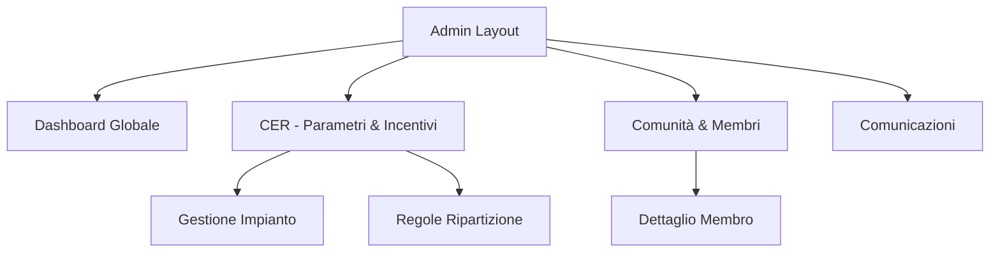

# Struttura di Navigazione - Attore: Gestore (Admin)

La navigazione della web app dedicata al Gestore è progettata per offrire un controllo granulare sulla Comunità Energetica Rinnovabile (CER). L'interfaccia si basa su una **Sidebar persistente** a sinistra e una **Topbar funzionale** per lo switch del contesto (Tenant).

## 1. Sidebar Menu (Navigazione Principale)
La sidebar è il centro di controllo dell'amministratore. Di seguito il dettaglio della navigazione interna a ciascuna sezione:

### 📊 Dashboard Globale
È la vista d'atterraggio. Non presenta sotto-pagine ma è ricca di navigazione informativa:
*   **Widget KPI**: Quattro cluster principali (Energia, Economia, Sostenibilità, Efficienza).
*   **Pannello Rapido Membri**: Sidebar contestuale a destra che elenca i membri attivi/offline con stato in tempo reale.
*   **Grafico Settimanale**: Visualizzazione comparativa di Produzione, Prelievo e Autoconsumo.
*   **Meteo & Previsioni (Consumo Consapevole)**: Pannello interattivo con timeline oraria delle previsioni, irradianza e indicatore qualitativo della produzione (es. "Ottimale" con smiley) per guidare l'autoconsumo.
*   **Grafico Flussi Energetici (Real-time Flow Diagram)**: Visualizzazione a nodi e frecce dei flussi energetici istantanei dell'intera CER. Posizionato in fondo alla Dashboard, offre una lettura immediata e visiva della situazione energetica aggregata in tempo reale.
    *   **Nodi principali**: Prodotta (totale impianti FV), Accumulo (batterie), Consumata (carico aggregato community), Rete (rete elettrica pubblica).
    *   **Flussi visualizzati con frecce direzionali e colori semantici**:
        *   🟡 **Immessa in Rete** (kW): quota di energia prodotta in eccesso rispetto al consumo, ceduta alla rete.
        *   🔴 **Prelevata dalla Rete** (kW): energia aggiuntiva assorbita dalla rete per soddisfare la domanda.
        *   🔵 **Autoconsumata** (kW): energia prodotta usata direttamente dai prosumer/producer.
        *   🟢 **Autoconsumata Virtualmente** (kW): quota di produzione condivisa con i consumer della CER tramite il meccanismo di autoconsumo virtuale GSE.
    *   **Timestamp**: indica l'orario dell'ultimo aggiornamento dei dati (es. "Ultimo aggiornamento: 05/08/2023 16:00:00").

### ⚡ CER (Gestione & Configurazione)
Questa sezione accorpa tutti i parametri tecnici ed economici della comunità, organizzata tramite una navigazione a 2 tab principali:
*   **Dati Generali**: 
    * Configurazione dell'anagrafica della CER (Nome, Indirizzo, Codice Fiscale, Codice Area, Note).
    * Localizzazione geografica tramite Mappa interattiva.
    * Monitoraggio Asset e POD Collegati: Stato dell'unico impianto fotovoltaico (54kW) e dei 5 POD associati ai membri (1 Producer, 1 Prosumer, 3 Consumer).
*   **Ripartizione Incentivi**:
    *   **Monitoraggio Maturato (Widget Unificato):** L'admin supervisiona un widget orizzontale in testata che accorpa gli **Incentivi Maturati** (es. € 1.250,00) e la **Quota Recupero Investimento** mensile, indicando chiaramente lo stato dell'erogazione GSE (es. "In attesa").
    *   **Modello Proporzionale**: Visualizzazione grafica della composizione in percentuale dell'allocazione del ricavo (es. Produttori 45%, Consumatori 30%, Fondo CER 25%).
    *   **Regole di Ripartizione**: Modale per la ricalibrazione delle percentuali totali del tesoretto e della quota fissa.
    *   **Quote Individuali dei Membri**: Lista analitica (su doppia colonna) che mostra il ruolo degli utenti, la ripartizione spettante applicata e la stima mensile calibrata sull'incentivo maturato.

### 👥 Comunità & Membri
Gestione dell'anagrafica e monitoraggio dei partecipanti:
*   **Tabella/Griglia Membri**: Vista principale con filtri per Ruolo (Consumer, Prosumer, Producer) e barra di ricerca.
*   **Dettaglio Membro**: Cliccando su una card, si naviga alla pagina specifica del membro (`/admin/community/:id`).
    *   *Sotto-sezioni Dettaglio*: Anagrafica e Profilo Energetico (Grafico Recharts 24h).

### 🔔 Comunicazioni
Centro di comando per le notifiche push alla community:
*   **Composer Broadcast**: Form per la creazione di messaggi (Critici o Informativi).
*   **Quick-Alerts**: Modelli predefiniti per invio rapido di comunicazioni su maltempo o picchi di produzione.
*   **History**: Elenco cronologico delle ultime notifiche inviate.

## 2. Topbar Funzionale
Permette la gestione multi-tenant e il monitoraggio dello stato del sistema:

*   **Tenant Switch (Dropdown)**: Consente di cambiare istantaneamente la vista tra diverse CER gestite (es. CER Centro, CER Industriale).
*   **Stato Sistema (Badge)**: Indicatore live "Sistema Operativo" con animazione di heartbeat.
*   **Profilo Admin**: Avatar e accesso rapido alle impostazioni del profilo gestore.

## 3. Gerarchia delle Pagine (Sitemap)

## 4. Design & UX
*   **Stile**: Dark Sidebar con accenti Indigo/Glassmorphism.
*   **Sidebar Collassabile**: L'utente può ridurre la sidebar a una vista compatta (solo icone) per massimizzare lo spazio di lavoro, con tooltip informativi al passaggio del mouse.
*   **Sidebar Interattiva**: La voce attiva è evidenziata con un background traslucido e bordo colorato (Indigo).
*   **Integrazione**: La rimozione delle sezioni autonome "Ripartizioni" e "Gamification" semplifica la navigazione, centralizzando il valore economico all'interno della sezione tecnica "CER".
*   **Context Awareness**: Cambiando il Tenant nella Topbar, tutte le pagine sottostanti aggiornano automaticamente i dati visualizzati.
